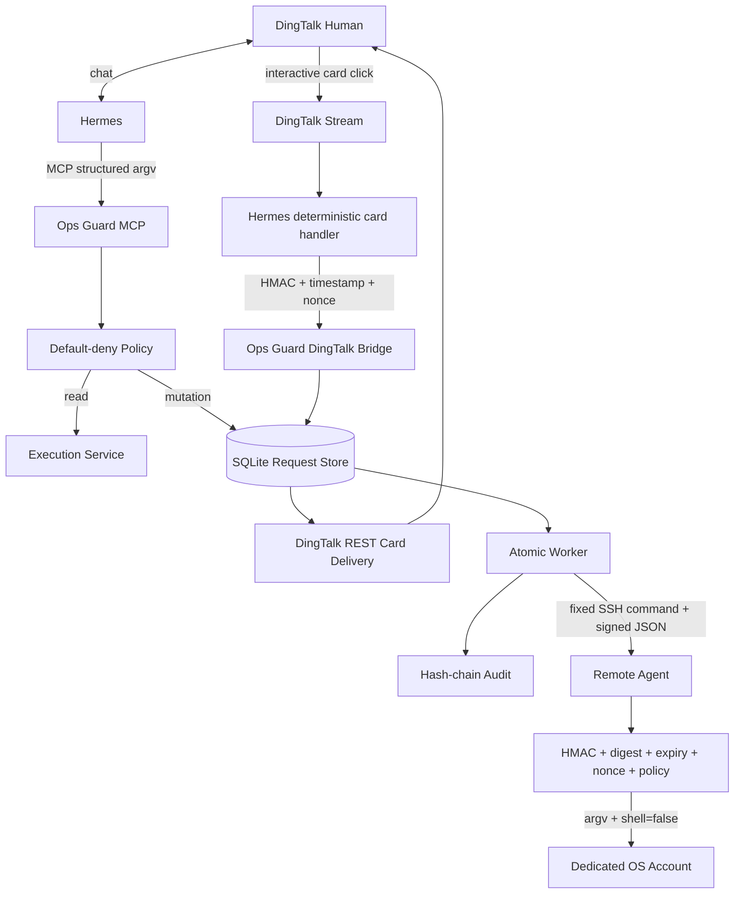
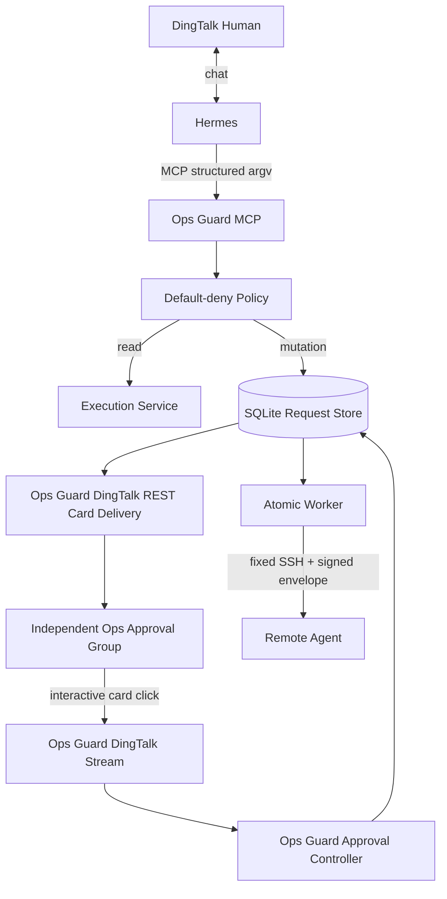

# 架构设计 v0.2.2

## 推荐拓扑：Hermes + DingTalk



## 独立审批 Stream 拓扑（生产推荐）



独立模式使用：

```toml
callback_owner = "ops_guard"
```

安全边界比 Hermes bridge 更简单：卡片点击的 `userId` 直接从 Ops Guard 自己持有的 DingTalk Stream 进入 `DingTalkApprovalController`，不经过 Hermes 进程。生产建议 Hermes 与 Ops Guard 使用不同 DingTalk Client ID / Secret。完整部署见 `DINGTALK_STANDALONE_STREAM.md`。

## 信任边界

### LLM / MCP 不可信输入

以下全部视为不可信：host_id、argv / args、reason / requester、脚本内容，以及 MCP 返回后模型对状态的自然语言解释。LLM 无审批能力。

### DingTalk callback 身份

审批身份来自 DingTalk Stream card callback 的 `userId`，不是对话文字。Hermes 模式下平台 adapter 只做窄可信传输：只接收 `ops-guard-*` card、只接受固定 action、转发前签 HMAC、不调用 LLM，也不存在 MCP approve tool。

### Gateway / Agent

Gateway 决定策略、审批状态和传输；Agent 不盲信 Gateway 的风险等级，而会重新判级并检查完整 request digest。

## 审批状态机

```text
BLOCKED

PENDING_APPROVAL
   ├─ approve -> APPROVED -> EXECUTING -> SUCCEEDED / FAILED / BLOCKED
   └─ reject  -> REJECTED

EXPIRED
```

安全性质：最终决定不可翻转；同一决定重复回调幂等；执行领取原子化；请求 JSON 被修改会 digest mismatch 并 BLOCKED。

## DingTalk Stream ownership

`callback_owner = "hermes"` 推荐给 Hermes 同会话场景；Ops Guard 只用 REST 创建/投放卡片。`callback_owner = "ops_guard"` 用于独立应用/独立审批群。
